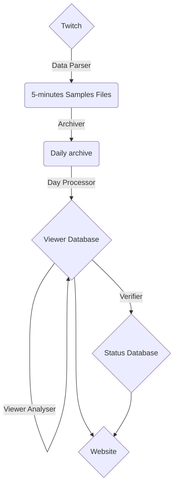

# TwitchProfiler
## Abstract
This document is created to summarize my work on my project Twitch profiler. I worked on this project for more than 2 months (at the moment as I write this document) but the information gathering pipeline is fully automated and will so continue to work passively.
In this paper, I will describe how I successfully tracked more than 5.6M french viewer on the [Twitch platform](https://www.twitch.tv/). To do so, I developed some automated procedure for verifying and expending my database.
At the moment of writing this document, 5.6M user are tracked, with an average of 900K different user daily tracked.
It is possible for you to use [this website](https://profiler.hexadecilab.com) to view the state of my database and anonymized information about random user (username: **visitor** | password: **visitorpassword**).
For evident legal and ethical reason, this database will not be used for any commercial product or service.
## Motivation
This project has started when I found an URL provided by Twitch *(not officially)* which allow getting the pseudonym of people connected to the [IRC chat](https://fr.wikipedia.org/wiki/Internet_Relay_Chat) of the polled streamer.
Indeed, when a user is authenticated on the Twitch website and watch a stream on desktop, he is automatically connected to the IRC chat of the streamer. This allows us to have a representative  sample of the streamer viewer base. Knowing that I wanted to challenge me on this project to learn how to handle huge data structure and data processing.
## Tool chain
The following tool chain has been created:

Each element will be detailed below.
## Tools
### Data Parser
The goal of the data parser is for every tracked streamer to get the list of the actual viewer.
The tracked streamers are the actual top 100 french streamer (sorted per actual viewer) with a list of always tracked streamer.
 
In practice, each 5 minutes (which seems to be the lowest resolution provided by the endpoint) a python script poll the corresponding streamer endpoint. Using the official Twitch API, we also get for every streamer:

 - The real viewer count (to get the number of anonymous viewer)
 - The actual name of the stream (for potential text recognition algorithms)
 - The content streamed (name of the game, activity, ...)
 All of this information is stored in a JSON file with the actual timestamp as the name.
The parser is deployed on a Linux machine and restarted automatically on crashes.
### Archiver
 Because each day the ~ 288 JSON file has a total weight of around 300 MB, it is necessary to store the data in archive. This is why every day the last day is archived in .7z as this is the format that compress the better for my usage and is open source. The compressed archive weight is around 25-30 MB.
The archiver is deployed on the same Linux machine as the Parser and act every 24 hours at 2 AM GMT. 
### Day Processor
The purpose of the Day Processor is to transform the actual data structure from
 ```mermaid
graph TD;
    A1{1659359200} --> B1(Streamer 1);
    B1 --> C1[Viewer 1];
    B1 --> C2[Viewer 2];
    B1 --> C3[Viewer 3];
    A1 --> B2(Streamer 2);
    B2 --> C4(...)
    A1 --> B3(...)
    AA1{1659359205} --> BB1(Streamer 1);
    BB1 --> CC1[Viewer 1];
    BB1 --> CC2[Viewer 2];
    BB1 --> CC3[Viewer 3];
    AA1 --> BB2(Streamer 2);
    BB2 --> CC4(...)
    AA1 --> BB3(...)

```
To 
 ```mermaid
graph TD;
    C1[Viewer1] --> A1{1659359200};
    A1 --> B1(Streamer 1);
    C1[Viewer1] --> A2{1659359205};
    A2 --> B2(Streamer 1);
    C2[Viewer2] --> AA1{1659359200};
    AA1 --> BB1(Streamer 1);
    C2[Viewer2] --> AA2{1659359205};
    AA2 --> BB2(Streamer 1);
    C4[Viewer3] --> AAAa3{...}
```

Each day, a tracked user is randomly selected, and his day activity is saved into the database for verification purpose.

Using this data structure, it is possible to profile user along in a day. If restructuring the data is a simple trivial algorithm, the real problem was to make it run on my computer. As the whole daily data has to be loaded in RAM by Python to associate it, this has limited the total number of streamer tracked in a day. 

With only the top 100 french streamer tracked, a day of information is taking more than 10 GB of RAM to restructure. Another problem is to then embed the useful data in an understandable format for the database which increased the RAM usage too. As the database is hosted on my personal computer for cost and performances reason, the database performances have to be taken into account when writing to it daily.

I chose to use MongoDB for being able to use the viewer name as index, and the simplicity as every document in the pipeline was already in a JSON format.

It is possible to see on the website (cf. abstract) statistics about the daily processing, such as the time taken and the daily user tracked.

### Viewer Analyzer

After the day added to the database, it is possible to deduce useful information from the collected data in prevision to further data processing (such as behavior prediction model). 
The actual state of the data processing calculate two categories of information:

 - All time
 - Local
 
 **Local workday schedule**
Using an 20-day exponential moving average, in is possible to calculate the hour in the day when the viewer use twitch. The data can be interpreted as the potential disponibility (in minutes) of the viewer at this hour.

 **Local weekend schedule**
Using an 8-day exponential moving average, in is possible to calculate the hour in the day when the viewer use twitch. The data can be interpreted as the potential disponibility (in minutes) of the viewer at this hour.

**All-Time favorite streamer**
This information is, for the chosen viewer, the total watched time for every streamer he ever watched.

**All-Time favorite game**
This information is, for the chosen viewer, the total watched time for every game he ever watched.

**Recent favorite streamer**
This information is for the chosen viewer, the score of this viewer regarding this streamer for every streamer he watched on the last 4 weeks range. The score is calculated on the time spent looking at a stream using the exponential moving average on 28 days.

**Recent favorite game**
Same as Recent favorite streamer but for games.

**Viewer analysis**
Some viewer has suspicious behavior (such as watching tenth of different streamer at the same time). As they are probably bots and increase artificially the size of the database, a ban list has been created to remove the data of those users.

This part of the tool chain is the most expensive to execute by far. If as the previous post-processing data are stored it is possible to reduce the amount of calculation if the whole database if often browsed, it is not enough for my computer.
The process fetch a random user in the database as they are not sorted (this is the downside of NoSQL database). And then process the data. If the user has already been processed for the day, the processing will not been done again, thus saving processing time.

As the processing of multiple viewer is independent, it is possible to parallelize this task. With 4 concurrent task, python use approximately 6 GB of RAM, and MongoDB 4 GB. The RAM is one of the bottleneck of this task as adding a 5th worker slow down the global process. Another bottleneck is the disk speed reading and latency.  With those characteristics, I process ~400 users per seconds. 

The time needed to statistically pass through the entire database can be calculated using [the answer to the Coupon collector problem](https://en.wikipedia.org/wiki/Coupon_collector%27s_problem#Calculating_the_expectation) which tell that the complexity of such systems is proportional to nlog(n) where n is the number of different document to go through (in my case 5.6M). According to this solution, I should process 37.7M documents. This represents 26 hours of processing. 

To deploy this system into production, it would be necessary to use a more powerful device, or to accept to have a maximum lag of 1 day on the post-processing data and process the data each day for 13 hours.

### Verification
To verify the sanity of the database, I check that the chosen user and user information stored in the part day processing correspond to the one in the database. If so, the database is correct.

## Website
The website has been created using the python framework [Django](https://www.djangoproject.com/). The design is based on the [Appseed UI kit](https://appseed.us/) even though some module and panels has been created by myself for the specific purpose of the application.
This Django application has been deployed on a Linux server running Apache.

### Main page

The main page is composed of 5 panels:
 - Show the global sanity of the database.
 - Show the number of user tracked the last day.
 - The graphical representation of the evolution of the number of daily user tracked.
 - The graphical representation of the sanity status of the database.
 - The graphical representation of the time taken for the day processing step.
### User page
< Insert user image>
The user page is composed of 7 panels:
 - Show the name of the user and the last date where the data were analyzed.
 - Show the recent favorite streamers.
 - Show the recent favorite games.
 - Show the all-time favorite streamers.
 - Show the all-time favorite games.
 - Show the local workday and weekend schedule.
 - Show the watch time heatmap of the user (the greener, the more time watched).
 - Show the day schedule of the user for the chosen day (for debug purposes).
## Conclusion
Working on this project taught me lots of different skills such as:
 - Designing efficient data structure
 - Working with daily database verification system
 - Optimization of process to reduce bottlenecks
 - Maintaining MongoDB databases
 - Developing an application using Django
 - Improving my front end development skills
 - Deploying a Django app on Apache
 - Scheduling tasks on Linux/Windows
 - Improving my GDPR knowledge

Multiples extension of this project comes into my mind:

 - Developing a machine learning algorithm to predict if a user will watch a stream of a certain streamer, playing a certain game at a certain moment.
 - Using the stream title data (with a text recognition system ?) to improve the created AI model
 - Create a streamer side for my website summarizing the anonymized data of the viewers with possibility of prediction.

Sadly, using this product for more than a small project seems complicated regarding the GDPR law. 

Thomas Bolteau - Hexadecilab @ 2022
