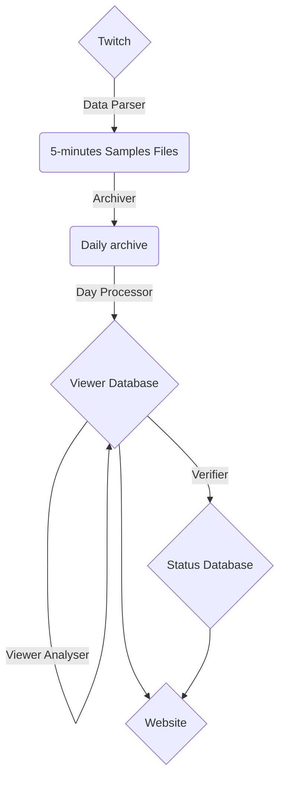

# TwitchProfiler
## Abstract
This document is created to summarize my work on my project Twitch profiler. I worked on this project for more than 2 month (as the moment as I write this document) but the information gathering pipeline is fully automated and will so continue to work passively.
In this paper I will describe how I successfully tracked more than 5.6M french viewer on the [Twitch plateform](https://www.twitch.tv/). To do so I developped some automated procedure for verifying and expending my database.
At the moment of writing this document, 5.6M user are tracked with an average of 900K different user daily tracked.
It is possible for you to use [this website](https://profiler.hexadecilab.com) to view the state of my database and anonimized information about random user (username: **visitor** | password: **visitorpassword**).
For evident legal and ethical reason, this database will not be used for any commercial product or service.
## Motivation
This project has started when I found an url provided by Twitch *(not officialy)* which allow to get the pseudonym of people connected to the [irc chat](https://fr.wikipedia.org/wiki/Internet_Relay_Chat) of the polled streamer.
Indeed, when an user is authenticated on the Twitch website and watch a stream on desktop, he is automaticaly connected to the irc chat of the streamer. This allow us to have a representative  sample of the streamer viewer base. Knowing that I wanted to challenge me on this project to learn how to handle huge data structure and data processing.
## Toolchain
The following toolchain has been created:

Each element will be detailed below.
## Tools
### Data Parser
The goal of the data parser is for every tracked streamer get the list of actual viewer.
The tracked streamer are the actual top 100 french streamer (sorted per actual viewer) with a list of always tracked streamer.
 
In practice, each 5 minutes (which seems to be the lowest resolution provided by the endpoint) a python script poll the corresponding streamer endpoint. Using the official Twitch API, we also get for every streamer:

 - The real viewer count (to get the number of anonym viewer)
 - The actual name of the stream (for potential text recognition algorithms)
 - The content streamed (name of the game, activity, ...)
 All of thoses information are stored in a JSON file with the actual timestamp as the name.
The parser is deployed on a linux machine and restarted automaticaly on crashes.
 ### Archiver
 Because each day the ~ 288 json file has a total weight of around 300MB, it is necessary to store the data in archive. This is why every day the last day is archived in .7z as this is the format that compress the better for my usage and is open source. The compressed archive weight is around 25-30MB.
The archiver is deployed on the same linux machine as the Parser and act every 24 hours at 2 AM GMT. 
### Day Processor
The purpose of the Day Processor is to transform the actual data structure from
 ```mermaid
graph TD;
    A1{1659359200} --> B1(Streamer 1);
    B1 --> C1[Viewer 1];
    B1 --> C2[Viewer 2];
    B1 --> C3[Viewer 3];
    A1 --> B2(Streamer 2);
    B2 --> C4(...)
    A1 --> B3(...)
    AA1{1659359205} --> BB1(Streamer 1);
    BB1 --> CC1[Viewer 1];
    BB1 --> CC2[Viewer 2];
    BB1 --> CC3[Viewer 3];
    AA1 --> BB2(Streamer 2);
    BB2 --> CC4(...)
    AA1 --> BB3(...)

```
To 
 ```mermaid
graph TD;
    C1[Viewer1] --> A1{1659359200};
    A1 --> B1(Streamer 1);
    C1[Viewer1] --> A2{1659359205};
    A2 --> B2(Streamer 1);
    C2[Viewer2] --> AA1{1659359200};
    AA1 --> BB1(Streamer 1);
    C2[Viewer2] --> AA2{1659359205};
    AA2 --> BB2(Streamer 1);
    C4[Viewer3] --> AAAa3{...}
```

Using this data structure, it is possible to profile user along in a day. If resturing the data is a simple trivial algorithm the real problem was to make it run on my computer. As the whole daily data has to be loaded in RAM by Python to associate it, this has limited the total number of streamer tracked in a day. 

With only the top 100 french streamer tracked, a day of information is taking more than 10GB of RAM to restructurate. Another problem is to then embed the useful data in an understable format for the database which increased the RAM usage too. As the database is hosted on my personnal computer for cost and performances reason, the database performances has to be taken into account when writing to it daily.

I choosed to use MONGO DB for being able to use the viewer name as index, and the simplicity as every document in the pipline was already in a JSON format.
